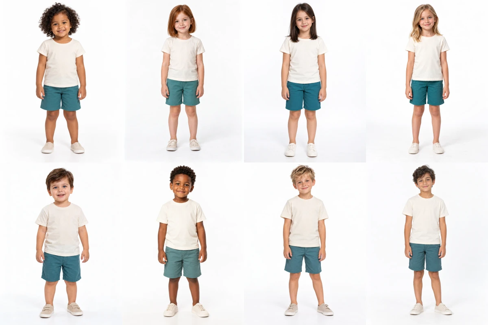

# Issue #24 cast review

Revision: `issue-24-cast-v3`. Status: **approved by the user**.

Revision 3 changes Bia (`model-002`) to green eyes and Caio (`model-005`) to blue eyes, preserving their existing identities and styling. Revision 2's replacements remain: Nina (`model-003`) is a fictional Russian girl with dark hair; Iara (`model-004`) is a blonde girl with blue eyes. Ages, names, photographed sizes and product assignments are retained. The user removed superseded WebP files and requested cleanup of remaining old images. The four superseded originals for models 002–005 have now been deleted; eight approved originals and eight current WebP references remain. Historical prompts and hashes are retained as provenance, explicitly marked as deleted rather than active file references.

This package presents eight recurring fictional child references for [issue #24](https://github.com/danielluis07/difratelli-kids-v2/issues/24). The prerequisite catalog/copy/garment approval is recorded in [approval.json](approval.json). The cast and future sample pair require separate human decisions under [the delivery plan](../implementation-plan.md#3-approve-child-references-and-all-required-assets).

## Review images

The contact sheet is arranged left to right: Lia, Bia, Nina, Iara on the first row; Caio, Davi, Theo, Noah on the second. Inspect the individual WebP references for facial identity and proportions; the contact sheet is a reduced review aid.



| ID | Name | Fictional age | Reference | Product assignments |
| --- | --- | --- | --- | --- |
| model-001 | Lia | 3 | [Full image](../../public/images/cast/model-001-reference-v1.webp) | 003, 007, 028 |
| model-002 | Bia | 5 | [Full image](../../public/images/cast/model-002-reference-v2.webp) | 004, 013, 017, 027 |
| model-003 | Nina | 6 | [Full image](../../public/images/cast/model-003-reference-v2.webp) | 005, 016, 023 |
| model-004 | Iara | 8 | [Full image](../../public/images/cast/model-004-reference-v2.webp) | 014, 024 |
| model-005 | Caio | 2 | [Full image](../../public/images/cast/model-005-reference-v2.webp) | 002, 008, 021 |
| model-006 | Davi | 4 | [Full image](../../public/images/cast/model-006-reference-v1.webp) | 001, 006, 011, 019 |
| model-007 | Theo | 6 | [Full image](../../public/images/cast/model-007-reference-v1.webp) | 009, 012, 015, 025, 029 |
| model-008 | Noah | 8 | [Full image](../../public/images/cast/model-008-reference-v1.webp) | 010, 018, 020, 022, 026, 030 |

Product numbers above use the permanent `product-` prefix. [cast-proposal.json](cast-proposal.json) records identity briefs, ages, photographed sizes and exact product assignments. [cast-manifest.json](cast-manifest.json) records actual dimensions, source/WebP hashes, paths, Portuguese alt text, collections and all colorway associations. Four girls and four boys cover younger/older ages within 2–8. Each of 30 products is assigned once; all 42 colorways inherit that product's model. Batch by the three approved collections; the same references carry across collection batches where their assignments require it.

All subjects are AI-generated fictional characters. Neutral cream T-shirts and teal shorts identify the cast without committing a catalog design. The casting clothes are not the forthcoming sample garment and must not be used as catalog imagery. Review apparent age, distinctive identity, natural proportions and suitability for the approved everyday brand.

## Reproducibility and validation

The built-in image generation tool produced the references. [cast-generation.json](cast-generation.json) retains the exact prompts and repository-local originals. Generated source files remain separately under `assets/originals/cast/`; web-ready exports live under `public/images/cast/`. Full-frame exports preserve native dimensions. Casting references are not subject to the catalog photograph minimum; actual catalog pairs must be at least 1200 × 1600 and 3:4.

Rebuild the derived WebP files, manifest and contact sheet from the retained originals with:

```sh
bun scripts/content/prepare-cast.mjs
```

The preparation command validates cast counts/ages, offered photographed sizes, product/audience associations, complete unique product coverage, all colorway assignments, source aspect ratios and matching export dimensions. Its success verifies these technical conditions. Human approval of this exact cast revision is recorded separately in [cast-approval.json](cast-approval.json), with the eight original/WebP hashes and product assignments.

Validation on 9 October 2026, refreshed for revision 3: the preparation command passed for eight references, 30 unique products and all 42 colorways. Every original and WebP reference measures 1086 × 1448 (3:4); no source was enlarged or cropped. The agent inspected Bia and Caio's new full-size WebP references for green and blue eyes respectively, identity continuity, full-body framing and visible neutral clothing. Relative to cast revision 2, exactly models 002 and 005 have changed source/export hashes; the other six originals and WebP exports retain their previous hashes, including the revised Nina and Iara references. ESLint passed for the preparation script during revision 2; the script is unchanged in revision 3. The approved catalog and copy files still match the SHA-256 hashes recorded in `approval.json`. These checks apply to casting references; sample-pair resolution and garment matching remain unverified until the actual sample photographs exist.

## Approval and next sample

The user explicitly approved `issue-24-cast-v3` in this conversation, recorded at 22:08:51 UTC on 9 October 2026. [cast-approval.json](cast-approval.json) binds that decision to the reviewed original/WebP hashes, identities and all product assignments. Approval changes only the status fields; image bytes and product assignments are unchanged. Cleanup removes superseded images without altering approved references. The cast gate is satisfied.

Cleanup validation: all 16 approved image hashes match the approval record; exactly eight original PNGs and eight current WebP files remain in the project cast folders. The export script passed ESLint and regenerated the manifest with approved status. Deleted originals are historical provenance only; rebuilding uses current approved originals and does not recreate superseded versions.

After cast approval, produce `product-006` / `cream-teal-leaf` (Conjunto Descobertas) on Davi (`model-006`) in size 4: first the child wearing the complete cream printed T-shirt and plain teal shorts, then the isolated complete two-piece set derived from that photograph. Both photographs must match the approved garment brief and each other. Proposed Portuguese alt text, filenames, export rules and sample review criteria are in [photography-standard.md](photography-standard.md).

The sample pair has not yet been generated or approved. Remaining catalog photography awaits approval of that actual pair. Issue #24 remains incomplete until the sample approval is recorded; collection batches and storefront implementation retain their later gates.

A worn-sample production attempt on 9 October 2026 used Higgsfield's `virtual_model_tryout` product-photoshoot mode with the approved Davi reference, product-006 garment brief, 3:4 framing and a native minimum 1200 × 1600 requirement. It failed before returning an image: `Cannot reach https://fnf-api-gw.higgsfield.ai/fnf/developer/v2alpha/product-photoshoot/enhance.` No sample photograph or pair approval is asserted. Production must resume with a reachable image-generation service and measured compliant output.
