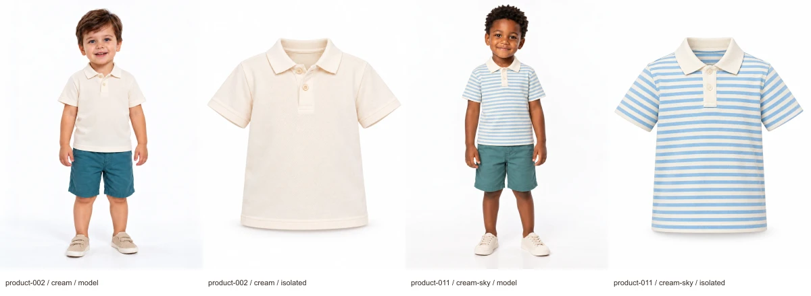

# Two replacement polos — issue #51

Revision: `issue-51-polos-v1`. **Approved by the user**, including exact Portuguese copy, all four photographs and the revised catalog package. [polo-approval.json](polo-approval.json) records the explicit decision and reviewed/approved SHA-256 hashes.

Authority: [issue #51](https://github.com/danielluis07/difratelli-kids-v2/issues/51). The user agreed to two separate solid/striped polo products replacing two boys' printed T-shirts, then approved the proposed replacements, colors, category, composition, fit, sizes and prices. [polo-assortment-approval.json](polo-assortment-approval.json) records this evidence; it does not claim approval of subsequently generated files.

## Review the exact products

Open [the photograph review](polo-review.html), click each image to inspect the full WebP, and review [the exact files and hashes](polo-approval-request.json). The four native originals and WebP exports are 1086 × 1448, exactly 3:4, with no enlargement, following the existing accepted resolution for their respective collections. WebP quality is 90; the complete frame is preserved. Model-first and isolated-second ordering is explicit.

| Product | Replaces | Collection | Colorway | Assigned child |
| --- | --- | --- | --- | --- |
| product-002 — Polo Lisa do Quintal | Camiseta Besourinhos | Quintal de Descobertas | cream — Creme | Caio, model-005, size 2 |
| product-011 — Polo Listrada da Rua | Camiseta Volta de Bicicleta | Brincadeira de Rua | cream-sky — Creme e azul-céu | Davi, model-006, size 4 |

Both products cost **R$ 79,00**, offer **2, 4, 6 and 8**, and use **100% cotton piqué**, with a relaxed straight fit, short sleeves, folded collar and two tonal cream buttons. No logos, embroidery, pockets, decorative graphics or contrasting trim. The striped polo has narrow horizontal cream and sky-blue stripes across body/sleeves, with a solid cream collar and placket. Supporting shorts and shoes in model photographs are styling only and are excluded from the isolated garment photographs.

### Polo Lisa do Quintal

- Slug: `polo-lisa-do-quintal`; category: `polos`; audience: `boys`; pattern: `plain`.
- Description: “Polo creme em piquê de algodão, com gola dobrada e dois botões no mesmo tom, para combinar com as descobertas do dia.”
- Composition: “100% algodão.”
- Fit: “Modelagem reta e confortável, com mangas curtas e comprimento até o quadril.”
- Garment color: cream `#F3EBDD`; color family: `cream`.
- [Model](../../public/images/catalog/product-002-cream-model-v1.webp) · [Isolated](../../public/images/catalog/product-002-cream-isolated-v1.webp).

### Polo Listrada da Rua

- Slug: `polo-listrada-da-rua`; category: `polos`; audience: `boys`; pattern: `striped`.
- Description: “Listras finas creme e azul-céu acompanham esta polo em piquê de algodão, com gola creme lisa e dois botões no mesmo tom.”
- Composition and fit: same as the solid polo.
- Garment colors: cream `#F3EBDD` and sky-blue `#A9CCE0`; color families: `cream`, `blue`.
- [Model](../../public/images/catalog/product-011-cream-sky-model-v1.webp) · [Isolated](../../public/images/catalog/product-011-cream-sky-isolated-v1.webp).

## Effect on the content package

The catalog remains **30 products, 42 colorways and 84 active catalog photographs**. There are **eight categories**, with **six Camisetas and two Polos**; all other category counts are unchanged. The pattern split becomes **16 printed, 13 plain and one striped**. Each collection still has ten products, fourteen colorways, four girls' products, four boys' products and two suitable for both. Camiseta Blocos de Ideias remains unchanged.

The replacement styles retain their existing product IDs, collection positions, coordinating products, assigned child identities and curated selections; their slugs, colorway IDs and garment records change. The existing new-arrival and homepage selection of product-011 now resolves to the striped polo. A new Polos category tile uses product-002 / cream and links to `/produtos?categoria=polos`. Neither the catalog nor this tile is integrated into the starter storefront yet; storefront implementation remains a later stage.

Both affected collection manifests/generation records/contact sheets now select the approved new polo pairs. The other 26 photographs in each affected collection retain their exact original/WebP hashes and previous approvals. Old T-shirt photographs remain retained for provenance and editorial references, but are excluded from the active catalog manifests. All editorial originals and crops remain unchanged.

The complete earlier catalog, approval, affected manifests/generation records and review artifacts are retained byte-for-byte in [catalog-revisions/pre-issue-51](catalog-revisions/pre-issue-51/catalog-proposal.json). [approval.json](approval.json) records the current catalog approval with both reviewed and approved hashes and points to that historical approval. Existing copy remains unchanged. Earlier collection approval files bind historical photographs only; [polo-approval.json](polo-approval.json) binds the exact new polo photographs and revised files.

## Reproduce verification

Run `bun scripts/content/prepare-polos.mjs` from the repository root. The existing Quintal and Brincadeira preparation commands route this revision through the same pipeline. It verifies the approved baseline snapshot, limits catalog changes to the agreed assortment, validates category/collection/audience/size/tile associations, verifies child-reference hashes, measures native dimensions and opacity, checks original and encoded hashes and exports, and verifies every editorial original/crop hash. It regenerates the manifests, contact sheets and review; it never invents a human approval.

Generation used the built-in imagegen tool. [polo-generation.json](polo-generation.json) retains the exact four prompts, input references, original paths, tool output locations, dimensions and SHA-256 hashes. [polo-manifest.json](polo-manifest.json) records WebP paths, hashes, gallery order, usage and Brazilian Portuguese alt text.

The user replied “approved” to the exact Portuguese names/copy and garment briefs, four photographs, revised catalog/category tile, cast colorway associations and both collection selections named in [polo-approval-request.json](polo-approval-request.json). This satisfies the revised content approval required by issue #51. Only approval flags, source links and review/gate descriptions changed after review; the approved copy and image bytes remain unchanged. Complete-content, storefront integration and release approvals remain separate.
