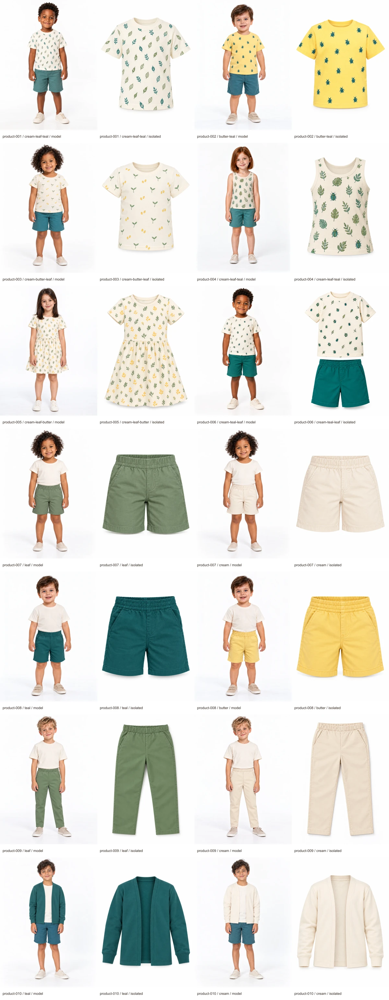

# Quintal de Descobertas photography — issue #25

Revision: `issue-25-quintal-v1`. Status: **all 28 photographs approved by the user**, with technical verification passed under the accepted collection resolution revision.

Authority: [issue #25](https://github.com/danielluis07/difratelli-kids-v2/issues/25), [parent #22](https://github.com/danielluis07/difratelli-kids-v2/issues/22), and [photography standard](photography-standard.md). The approved catalog, copy, garment briefs and cast assignments are retained unchanged.

## Review the complete collection

Exactly ten products and fourteen colorways have 28 selected photographs. Every pair is model first, isolated garment second. Product-006 reuses the approved sample. Supporting neutral clothes on models of separately sold garments are styling only; isolated photographs contain only the purchased garment. The matching set shows both complete pieces in both roles.



Inspect the individual WebP files at full size for detail; the contact sheet is a reduced review aid.

| Product | Colorway | Assigned child | Worn image | Isolated image | Approval |
| --- | --- | --- | --- | --- | --- |
| product-001 — Camiseta Folhas ao Vento | Creme, verde-folha, verde-petróleo (`cream-leaf-teal`) | Davi, size 4 | [Model](../../public/images/catalog/product-001-cream-leaf-teal-model-v2.webp) | [Isolated](../../public/images/catalog/product-001-cream-leaf-teal-isolated-v2.webp) | Approved |
| product-002 — Camiseta Besourinhos | Amarelo-manteiga, verde-petróleo (`butter-teal`) | Caio, size 2 | [Model](../../public/images/catalog/product-002-butter-teal-model-v1.webp) | [Isolated](../../public/images/catalog/product-002-butter-teal-isolated-v1.webp) | Approved |
| product-003 — Camiseta Pequenas Sementes | Creme, amarelo-manteiga, verde-folha (`cream-butter-leaf`) | Lia, size 4 | [Model](../../public/images/catalog/product-003-cream-butter-leaf-model-v1.webp) | [Isolated](../../public/images/catalog/product-003-cream-butter-leaf-isolated-v1.webp) | Approved |
| product-004 — Blusa Jardim Miúdo | Creme, verde-folha, verde-petróleo (`cream-leaf-teal`) | Bia, size 6 | [Model](../../public/images/catalog/product-004-cream-leaf-teal-model-v1.webp) | [Isolated](../../public/images/catalog/product-004-cream-leaf-teal-isolated-v1.webp) | Approved |
| product-005 — Vestido Passeio no Quintal | Creme, verde-folha, amarelo-manteiga (`cream-leaf-butter`) | Nina, size 6 | [Model](../../public/images/catalog/product-005-cream-leaf-butter-model-v2.webp) | [Isolated](../../public/images/catalog/product-005-cream-leaf-butter-isolated-v2.webp) | Approved |
| product-006 — Conjunto Descobertas | Creme, verde-petróleo, verde-folha (`cream-teal-leaf`) | Davi, size 4 | [Model](../../public/images/catalog/product-006-cream-teal-leaf-model-v1.webp) | [Isolated](../../public/images/catalog/product-006-cream-teal-leaf-isolated-v1.webp) | Approved (reused sample) |
| product-007 — Short Passo Leve | Verde-folha (`leaf`) | Lia, size 4 | [Model](../../public/images/catalog/product-007-leaf-model-v1.webp) | [Isolated](../../public/images/catalog/product-007-leaf-isolated-v1.webp) | Approved |
| product-007 — Short Passo Leve | Creme (`cream`) | Lia, size 4 | [Model](../../public/images/catalog/product-007-cream-model-v1.webp) | [Isolated](../../public/images/catalog/product-007-cream-isolated-v1.webp) | Approved |
| product-008 — Short Explorador | Verde-petróleo (`teal`) | Caio, size 2 | [Model](../../public/images/catalog/product-008-teal-model-v1.webp) | [Isolated](../../public/images/catalog/product-008-teal-isolated-v1.webp) | Approved |
| product-008 — Short Explorador | Amarelo-manteiga (`butter`) | Caio, size 2 | [Model](../../public/images/catalog/product-008-butter-model-v1.webp) | [Isolated](../../public/images/catalog/product-008-butter-isolated-v1.webp) | Approved |
| product-009 — Calça Caminho de Terra | Verde-folha (`leaf`) | Theo, size 6 | [Model](../../public/images/catalog/product-009-leaf-model-v3.webp) | [Isolated](../../public/images/catalog/product-009-leaf-isolated-v5.webp) | Approved |
| product-009 — Calça Caminho de Terra | Creme (`cream`) | Theo, size 6 | [Model](../../public/images/catalog/product-009-cream-model-v2.webp) | [Isolated](../../public/images/catalog/product-009-cream-isolated-v2.webp) | Approved |
| product-010 — Casaco Brisa do Quintal | Verde-petróleo (`teal`) | Noah, size 8 | [Model](../../public/images/catalog/product-010-teal-model-v1.webp) | [Isolated](../../public/images/catalog/product-010-teal-isolated-v1.webp) | Approved |
| product-010 — Casaco Brisa do Quintal | Creme (`cream`) | Noah, size 8 | [Model](../../public/images/catalog/product-010-cream-model-v1.webp) | [Isolated](../../public/images/catalog/product-010-cream-isolated-v1.webp) | Approved |

## Human decisions already recorded

The user replied “approved” after presentation of the exact product-006 / cream-teal-leaf sample pair. [catalog-sample-approval.json](catalog-sample-approval.json) records the evidence, timestamp and the two original/WebP hash pairs. Neither sample image was changed after approval.

The user then explicitly selected “Accept 1086 × 1448 for this collection.” This revises the minimum native dimensions for the 28 Quintal photographs only. All selected originals and exports measure exactly **1086 × 1448**, with 3:4 framing, opaque white backgrounds, no enlargement and full-frame exports. The original 1200 × 1600 minimum remains in force for the other collections. This is an explicit user requirement revision, not an inferred waiver or a technical pass against the old minimum.

## Visual review and corrections

The agent inspected each generated image before using it as a paired garment reference, and inspected the complete encoded contact sheet. Assigned fictional child references are retained in every worn request; secondary references preserve construction across the plain products' two colorways. All subjects and garments are fully framed, with white backgrounds and neutral studio light. This review supports the human decision; it does not substitute for it or establish calibrated physical fabric colors or motif measurements.

Corrections addressed oversized leaf motifs on product-001, a one-pixel aspect-ratio error on the first product-005 output, and repeated fly-style detail on product-009. Selected replacements are versioned. Superseded originals are retained separately under `assets/originals/catalog-rejected/`, with reasons and exact prompts/reference provenance where retained in [quintal-generation.json](quintal-generation.json). They are excluded from the 28-photo delivery.

**Accepted visual exception:** faint fly-like lines remain in product-009's two isolated trouser photographs, although the original approved brief specifies no fly. The final approval question expressly disclosed this detail and asked whether to approve the batch including it or regenerate those two images. The user replied “approved.” That decision is recorded for the exact isolated image hashes in [quintal-approval.json](quintal-approval.json). The images and original garment brief are unchanged; this exception applies to these approved photographs only.

## Delivery and verification

- Exactly 28 selected PNG originals: `assets/originals/catalog/`.
- Exactly 28 quality-90, full-frame WebP exports: `public/images/catalog/`.
- [quintal-manifest.json](quintal-manifest.json): stable IDs, product/colorway/role/order/model/size associations, paths, original/export/reference hashes, dimensions, byte sizes, usage, full-frame crop and Brazilian Portuguese alt text.
- [quintal-generation.json](quintal-generation.json): built-in tool, exact prompt set, input references, selected source locations and rejected-attempt provenance. No seed or model revision is exposed; byte-identical regeneration is not promised.
- [catalog-sample-approval.json](catalog-sample-approval.json): exact sample approvals and collection-scoped resolution revision.

Rebuild exports, manifest and contact sheet with:

```sh
bun scripts/content/prepare-quintal.mjs
```

The preparation script passed for ten products, fourteen colorways and 28 unique role associations. It verified offered photographed sizes, assigned approved child-reference hashes, exact selected-worn references for isolated requests, unchanged approved catalog/copy hashes, true native 3:4 dimensions, accepted minimum dimensions, opaque images, unchanged export dimensions, complete Portuguese alt/provenance fields and exact original/export folder counts. ESLint passed for both photography preparation scripts; `git diff --check` passed. No storefront code changed.

Manifest SHA-256 presented for this review: `a8fe140a7f15197f99a12284861886d1ad092d63fb80d03c920eb5ea40dc2afb`. The manifest binds every reviewed original and export to its own SHA-256 hash. A replacement invalidates that file's approval.

## Production history and approval outcome

Higgsfield account checks succeeded, but two sample-production retries failed at the product-photoshoot enhancement endpoint without returning images or job identifiers. After issue #24 was closed, the user explicitly selected the built-in image generator. Its initial undersized samples led to the explicit collection resolution revision above. Those service failures do not represent produced assets.

The user approved the complete batch on 9 October 2026, recorded at `2026-10-09T23:12:08Z`, including the expressly disclosed trouser detail. [quintal-approval.json](quintal-approval.json) binds the reviewed revision, reviewed manifest and contact sheet, all 28 original/WebP hash pairs, reviewer, exact approval evidence, timestamp and accepted exceptions. No corrections were requested.

The preparation script was rerun after recording approval: all 28 photographs match human approval and zero remain pending. All 56 original/export image hashes and the contact sheet hash are unchanged. Only approval metadata and review documentation changed. Approved manifest SHA-256: `62820d17495e7061c71882ff5b3d886da3351a904098b2cadaa92b4e0e2e894b`.

Issue #25's collection production and approval requirements are satisfied locally under the explicit collection-specific resolution revision and accepted trouser exception. Other collections, editorial/identity assets, complete-content, integration and release approvals remain separate. No GitHub issue state was changed.
